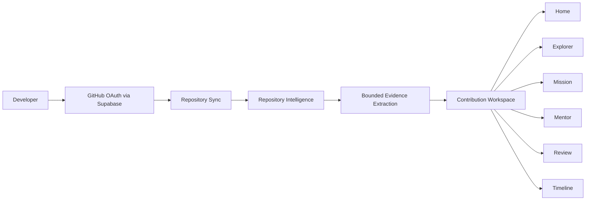

# OpenForge

[](#project-status)
[](frontend/package.json)
[](frontend/package.json)
[](package.json)
[](database/schema.sql)
[](LICENSE)

**A repository-aware workspace that helps developers understand unfamiliar codebases and contribute to open source with confidence.**

OpenForge brings repository structure, project conventions, source evidence, and contributor guidance into one coherent Workspace. It helps a developer understand how a project works, decide where to begin, and prepare a contribution without replacing GitHub or doing the thinking for them.

> **Understanding is the first contribution.**

## Product Overview

The hardest part of a first contribution is often not writing code. It is reconstructing the context that maintainers already have: how the system is organized, which conventions matter, what to read first, and what a responsible change requires.

OpenForge shortens that learning curve. A developer connects GitHub, syncs repositories they can access, opens a repository Workspace, explores evidence-grounded guidance, chooses a Mission, asks contextual questions, reviews contribution readiness, and follows their progress over time.

GitHub remains the source of truth for repositories, issues, pull requests, and collaboration. OpenForge adds a guided understanding layer. Unlike a general-purpose AI assistant, its Workspace is generated from bounded, repository-specific evidence and validated against the source material available to the application.

## Core Workspace

The Workspace is a connected contributor journey, not a collection of separate AI tools.

### Home

The repository entry experience establishes whether the repository is accessible, why it is relevant to the developer's GitHub relationship, how the project is built, and where exploration should begin. In the current implementation, this orientation is assembled from the repository detail, Workspace launcher, sync state, and initial Explorer context rather than stored as a separate generated module.

### Explorer

Explorer presents repository architecture, important concepts, module relationships, contribution areas, and an evidence-backed reading order. It is the first generated Workspace module.

### Mission

Mission turns repository understanding into a structured contribution workflow, including implementation context, testing expectations, and preparation steps supported by repository evidence.

### Mentor

Mentor provides repository-aware explanations. Questions are answered from a bounded evidence package, with selectable explanation depth and suggested follow-up questions.

### Review

Review helps contributors assess whether a change is ready for a pull request by surfacing repository expectations, tests, workflows, and contribution guidance that can be verified from the repository.

### Timeline

Timeline reflects meaningful contributor progress and learning context. Its evidence model supports Workspace events and Mentor learning history; the current UI renders the generated Timeline package, while richer user-authored reflections and Mission state remain areas for continued development.

## Repository Intelligence

Repository Intelligence is the internal system that turns GitHub data into grounded Workspace context. It uses the authenticated user's GitHub access, so it can inspect public repositories and private repositories authorized for that account.

The current pipeline collects and derives:

- repository identity, branch, language, topic, license, activity, and relationship metadata;
- a recursive Git tree, with ignored build/vendor paths and binary-file filtering;
- README content, contribution documents, project documentation, and licenses;
- dependency manifests and parsed package metadata;
- likely entry points, important source files, tests, and GitHub Actions workflows;
- bounded collaboration signals from commits, open issues, open pull requests, contributors, releases, and tags;
- selected source evidence ranked for the active Workspace module;
- secret-like file rejection and credential-pattern checks before evidence is used;
- per-file, total-byte, item-count, prompt, and token limits for large repositories.

Context snapshots are keyed to the repository head SHA and versioned extraction rules. Workspace modules and evidence packages are cached, marked stale when repository or content versions change, and regenerated lazily through a durable in-process job lifecycle with timeout recovery.

Generated content must use structured JSON, cite supplied evidence, reference real repository paths or identifiers, and pass grounding validation before storage. When evidence is insufficient, OpenForge records that state instead of filling the interface with generic claims.

> **Repository Intelligence is an internal engine. Users experience its results through the Workspace rather than through a separate analysis page.**

## How OpenForge Works



Repository synchronization uses GitHub's REST API for repository data and its GraphQL API for contributed-repository and contribution context. The backend owns GitHub access and all Repository Intelligence work; the frontend receives authenticated, user-scoped API responses.

## Current Feature Status

| Area | Status | Current scope |
| --- | --- | --- |
| GitHub OAuth and profile sync | Implemented | Supabase GitHub sign-in, authenticated session handling, profile/account sync, and onboarding |
| Public and authorized private repository sync | Implemented | Uses the connected GitHub account and verifies access before intelligence generation |
| Owned, forked, collaborator, contributor, and organization repositories | Implemented | REST affiliation sync plus GraphQL contributed-repository enrichment |
| Repository Intelligence | Implemented | Versioned context snapshots, recursive tree inspection, document/manifest/test/workflow detection, and collaboration counts |
| Workspace Home/orientation | Implemented | Repository selection, relationship context, repository detail, preparation state, and initial Workspace orientation |
| Explorer | Implemented | Grounded, generated Workspace module |
| Mission | Implemented | Grounded, generated Workspace module; deeper interactive Mission state is still evolving |
| Mentor | Implemented | Generated module plus repository-grounded question endpoint and history storage |
| Review | Implemented | Grounded, generated readiness guidance; it does not inspect a local git diff |
| Timeline | In progress | Generated module and learning-history persistence exist; richer reflections and progress interactions are not complete |
| Notifications | Implemented | List, read, read-all, and delete operations with a frontend center |
| Settings | Implemented | User profile and Workspace preference reads/updates |
| Background Workspace generation | Implemented | Durable database job state, asynchronous in-process execution, polling, stale state, retries, and startup timeout recovery |
| Evidence extraction and grounding | Implemented | Module budgets, ranking, truncation, path/identifier validation, and insufficient-evidence states |
| Groq provider integration | Implemented | OpenAI-compatible Groq endpoint remains supported through configuration |
| Multi-provider orchestration | Implemented | Provider registry, routing, retries, health/cooldowns, structured output, reduction, verification, and summary cache; operational maturity is still evolving |
| Automated test coverage | In progress | Backend tests cover orchestration, evidence extraction, and grounding; frontend/shared test scripts are placeholders |

## Technology Stack

Versions below come from the current package manifests.

### Frontend

- Next.js `^15.1.3`, React and React DOM `^19.0.0`
- TypeScript `^5.7.2`
- Tailwind CSS `^3.4.17`, PostCSS, and Autoprefixer
- Radix UI Slot, Class Variance Authority, `clsx`, and `tailwind-merge`
- Framer Motion and Lucide React
- Supabase JavaScript client `^2.108.2`

### Backend

- Node.js with Express `^4.21.2`
- TypeScript `^5.7.2` and `tsx`
- Zod `^3.24.1` for configuration and structured validation
- Helmet, CORS, and `dotenv`
- Asynchronous in-process Workspace jobs backed by durable PostgreSQL state

### Data and Authentication

- Supabase Authentication and GitHub OAuth
- Supabase JavaScript client `^2.108.2`
- PostgreSQL schema, incremental SQL migrations, and user-scoped Row Level Security policies

### Repository Intelligence

- GitHub REST and GraphQL APIs
- Recursive tree and file-content inspection
- Manifest, documentation, workflow, test, and source-path classification
- Bounded evidence selection, caching, redaction checks, and provenance validation

### AI

- Configuration-driven Groq support through an OpenAI-compatible adapter
- Provider abstraction with Z.AI, NVIDIA, OpenAI, and OpenRouter adapters
- Capability-aware routing, retries, cooldowns, and token budgets
- Structured JSON generation, deterministic evidence reduction, and grounding validation

See [Multi-provider AI orchestration](docs/ai-orchestration.md) for the implemented routing and grounding model.

## Repository Structure

```text
OpenForge/
├── frontend/
│   ├── app/                         # Next.js routes and authenticated application shell
│   ├── components/
│   │   ├── workspace/              # Explorer, Mission, Mentor, Review, and Timeline UI
│   │   ├── github/                 # Repository sync, list, and detail UI
│   │   └── dashboard/              # Overview, notifications, and settings UI
│   ├── lib/                         # API, environment, and Supabase clients
│   └── package.json
├── backend/
│   ├── src/
│   │   ├── ai/                     # Provider adapters and orchestration
│   │   ├── controllers/            # HTTP request handlers
│   │   ├── routes/                 # Versioned Express API routes
│   │   ├── services/               # GitHub, intelligence, evidence, and Workspace logic
│   │   └── server.ts               # Backend entry point and job recovery
│   ├── tests/                       # Node test-runner backend tests
│   └── package.json
├── shared/
│   └── src/                         # Shared API types, schemas, and constants
├── database/
│   ├── schema.sql                   # Baseline schema
│   └── migrations/                 # Ordered add-on migrations
├── docs/
│   ├── codex/                      # Product and engineering constitutions
│   └── ai-orchestration.md         # Current AI architecture
├── scripts/                         # Development, sync, and deployment guidance
├── docker-compose.yml              # Optional local PostgreSQL 16 service
├── package.json                    # Root orchestration scripts
└── README.md
```

## Prerequisites

- Node.js 20 LTS or newer is recommended. The repository does not currently pin a Node engine; its current Next.js and TypeScript toolchain must be supported by the selected runtime.
- npm `10.9.0`, as declared by the root `packageManager` field.
- A Supabase project with Authentication and PostgreSQL access.
- A GitHub OAuth application configured for the Supabase callback flow.
- At least one enabled AI provider API key and an explicit supported model ID. Groq is the simplest compatibility configuration; multi-provider orchestration supports the configured adapters listed above.
- Optional: Docker with Compose, or a local PostgreSQL installation, for the standalone development database service.

## Environment Setup

Create local environment files from the checked-in examples:

```text
frontend/.env.local  <- frontend/.env.example
backend/.env         <- backend/.env.example
```

The frontend file contains public application, API, and Supabase client configuration. The backend example groups configuration for:

- application ports, origins, runtime mode, and logging;
- Supabase URLs, keys, JWT verification, and database access;
- GitHub OAuth credentials;
- AI provider enablement, keys, endpoints, model registries, routing, retries, and timeouts;
- repository tree, file, byte, and collaboration extraction limits;
- Workspace module token budgets, evidence limits, prompt limits, and content versions;
- background job timeouts, parallelism, cooldowns, and recovery behavior.

Use [frontend/.env.example](frontend/.env.example) and [backend/.env.example](backend/.env.example) as the complete schema. Do not commit populated environment files.

A minimal Groq-compatible AI selection is:

```env
AI_PROVIDER=groq
AI_DEFAULT_MODEL=<supported-model-id>
GROQ_API_KEY=<your-key>
```

Model IDs are configuration-driven. For multi-provider operation, enable and configure at least one adapter with explicit model settings; providers without usable credentials or models are skipped.

## Installation

Install all three isolated packages from the repository root:

```bash
npm run install:all
```

Packages can also be installed independently:

```bash
cd shared
npm install
```

```bash
cd backend
npm install
```

```bash
cd frontend
npm install
```

## Running Locally

Run the backend and frontend in separate terminals from the repository root:

```bash
npm run dev:backend
```

```bash
npm run dev:frontend
```

Default local endpoints:

- Frontend: `http://localhost:3000`
- Backend: `http://localhost:4000`
- Health: `http://localhost:4000/health` (also available at `/api/v1/health`)

The optional Compose service starts PostgreSQL 16 and initializes a new volume from the baseline schema:

```bash
docker compose up -d postgres
```

Supabase remains required for the application's current authentication and service-client integration; the Compose database is a local PostgreSQL aid, not a complete local Supabase replacement.

## Build and Validation

The root package exposes these validation commands:

```bash
npm run typecheck
npm run build
npm run test
```

`typecheck` covers shared, backend, and frontend packages. `build` compiles the backend and builds the Next.js application. `test` runs the backend Node test suite, then the current frontend placeholder script; the shared package also has a placeholder test script and there is not yet comprehensive end-to-end coverage.

Package-specific build commands also exist: `npm run build:shared`, `npm run build:backend`, and `npm run build:frontend`.

## Database Migrations

The baseline schema is [database/schema.sql](database/schema.sql). Incremental changes live in [database/migrations/](database/migrations/) as ordered `addon-XX.sql` files.

Never edit a migration that has already been applied. Add each database change in the next unused add-on migration file, keep it forward-safe and user-isolated, and apply migrations in order after the baseline. The baseline still records historical tables that later migrations remove, so current installations require the full migration sequence.

## The OpenForge Codex

The [OpenForge Codex](docs/codex/01-manifesto.md) in `docs/codex/` is the project's product and contributor constitution. Its chapters define:

- product philosophy and the boundaries of what OpenForge should become;
- UX principles and the contributor experience;
- AI behavior, evidence standards, and responsible guidance;
- visual and interaction design principles;
- engineering and contribution rules;
- approved product language;
- the end-to-end experience map;
- a decision framework for evaluating changes.

Start with the [Manifesto](docs/codex/01-manifesto.md), use the [Language Guide](docs/codex/07-language-guide.md) when writing product copy, and apply the [Decision Framework](docs/codex/09-decision-framework.md) when proposing product changes.

> **If implementation choices conflict with the OpenForge Codex, the Codex takes precedence.**

## Security and Privacy

- GitHub access tokens are read and used only by backend services; they are not returned through frontend API contracts.
- Repository access is rechecked with the connected GitHub account before intelligence generation, including for private repositories.
- Context snapshots, Workspace modules, evidence caches, learning history, and job state are keyed by user and repository. Current migrations enable user-scoped RLS for these stores.
- Repository files are untrusted input. System prompts explicitly reject repository instructions and require claims to come from supplied evidence.
- Non-example environment files and content matching credential patterns are rejected; redaction metadata is recorded with each context snapshot.
- Tree entries, selected files, file bytes, total bytes, collaboration records, evidence items, prompt size, and token use are bounded by configuration.
- OpenForge stores selected and truncated repository evidence, derived knowledge packages, and generated Workspace content to support caching. It does not clone or intentionally persist an unrestricted full repository, but selected private source excerpts may be present in user-scoped backend storage.
- Grounding validation rejects unsupported cards, nonexistent paths, unknown evidence identifiers, and malformed structured output before generated content is marked ready.

These controls are implemented safeguards, not a completed security certification. Production deployment still requires threat modeling, secret-management review, monitoring, dependency review, and security testing.

## Project Status

OpenForge is under active development. The core repository sync, Repository Intelligence pipeline, and five generated contributor Workspace modules are implemented. Multi-provider orchestration, evidence grounding, durable generation state, notifications, and settings are also present.

The project is not yet production-ready. Frontend and end-to-end automated testing are limited, background work currently runs in the API process rather than a dedicated worker, Timeline and Mission interactions are still maturing, and deployment, observability, accessibility, performance, and security hardening remain ongoing.

## Roadmap

### Current

- Improve Repository Intelligence quality and source selection.
- Strengthen evidence extraction, provenance, and grounding verification.
- Increase Workspace generation reliability and recovery coverage.
- Improve bounded handling of large repositories.
- Complete interactive Mission, Timeline, and contributor feedback states.

### Next

- Mature multi-provider routing, evaluation, and operational diagnostics.
- Expand frontend, integration, and end-to-end automated tests.
- Harden deployment, monitoring, rate-limit handling, and security controls.
- Build feedback loops that show whether guidance increased contributor confidence.

## Contributing

1. Fork the repository or clone a branch you can write to.
2. Create a focused branch for one change.
3. Install dependencies with `npm run install:all`.
4. Configure local frontend and backend environment files from the examples.
5. Make the smallest coherent product or engineering change.
6. Run `npm run typecheck`, `npm run build`, and `npm run test`.
7. Open a pull request that explains the problem, the evidence for the approach, and any remaining limitations.

Product, language, UX, AI, and design changes must follow the [OpenForge Codex](docs/codex/01-manifesto.md). Database changes must use a new ordered add-on migration and must not rewrite applied migrations.

## License

OpenForge is available under the [MIT License](LICENSE).
