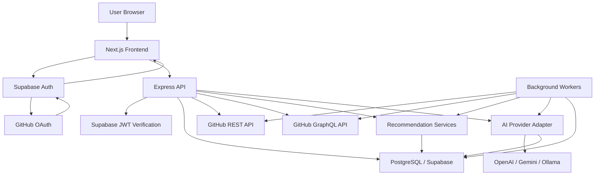

# OpenSource Compass - System Architecture

## Overview

OpenSource Compass is a production-grade SaaS platform that helps developers discover, understand, and contribute to open-source GitHub projects. The system combines GitHub OAuth, GitHub profile analysis, recommendation services, and AI-assisted repository and issue understanding.

The recommended architecture is a monorepo with:

- `frontend`: Next.js, React, TypeScript, Tailwind CSS, shadcn/ui, Framer Motion.
- `backend`: Node.js and Express REST API.
- `database`: PostgreSQL hosted through Supabase.
- `shared`: shared TypeScript types and validation schemas.
- `docs`: planning, architecture, and product documentation.

## Primary Runtime Components

| Component | Responsibility |
| --- | --- |
| Next.js frontend | User interface, protected app routes, dashboard, repository explorer, auth callbacks, client-side state orchestration |
| Express backend | REST API, business logic, GitHub API orchestration, AI provider orchestration, recommendation computation |
| Supabase Auth | GitHub OAuth, session issuing, auth callback handling, JWT identity |
| Supabase Postgres | Persistent application data, recommendation results, repository cache, issue cache, user settings, logs |
| GitHub REST API | User profile, repositories, issues, labels, README, releases, contributors, rate limit metadata |
| GitHub GraphQL API | Contribution graph, richer repository queries, batched issue/repository metadata |
| AI provider adapter | Provider-neutral access to OpenAI, Gemini, or Ollama-compatible APIs |
| Background workers | Repository sync, issue sync, recommendation refresh, notification generation, AI cache warming |

## Frontend, Backend, and Database Relationship

The frontend should not call GitHub APIs directly for product data. It should call the backend, which centralizes authorization, token usage, caching, rate-limit handling, and persistence.

Supabase Auth owns user authentication and session issuance. The backend validates Supabase JWTs on protected routes, maps the authenticated Supabase user to application records, and enforces row ownership before reading or writing data.

PostgreSQL stores durable user-specific records, GitHub snapshots, AI outputs, recommendations, saved items, notifications, and audit logs. Supabase Row Level Security should be enabled for all user-owned tables, even if most application access goes through the backend service role.

## GitHub API Integration

GitHub integration uses two API surfaces:

- REST API for user profile, repository lists, README contents, issues, labels, releases, contributors, and repository metadata.
- GraphQL API for contribution calendars, batched repository fields, pinned repositories, languages, and efficient nested queries.

The backend should store only the GitHub tokens required for the requested product features. OAuth provider tokens must be treated as secrets and never returned to the frontend. Repository and issue sync jobs should cache GitHub responses with `synced_at`, `etag`, and `rate_limit_reset_at` metadata where useful.

## AI Service Integration

The AI layer should be provider-neutral:

- `AiProvider` interface for `generateText`, `generateJson`, and optionally embeddings.
- Adapters for OpenAI, Gemini, and Ollama-compatible endpoints.
- Prompt modules for repository summary, issue explanation, skill gap analysis, learning roadmap, and contribution plan.
- Guardrails for input size, prompt injection, privacy, response schema validation, and cost limits.

AI outputs should be stored in `ai_analysis_logs` and linked to repositories, issues, users, or roadmaps when applicable. Frequently requested repository summaries should be cached.

## Supabase Auth Integration

Supabase Auth handles GitHub OAuth login and session refresh. The app should use:

- Frontend Supabase client for sign-in, callback handling, and session access.
- Backend Supabase JWT verification for protected routes.
- Backend Supabase admin/service client only for privileged writes, background jobs, and token lookup.

On first login, the backend should create or update `users`, `user_profiles`, and `github_accounts`.

## Data Flow Diagram

## High-Level Module Responsibilities

| Module | Responsibilities |
| --- | --- |
| Auth module | Session validation, current user lookup, logout, profile bootstrap |
| User module | Profile data, preferences, settings, skill profile ownership |
| GitHub module | OAuth account linking, API clients, repository sync, issue sync, contribution graph fetch |
| Recommendation module | Repository scoring, issue scoring, difficulty estimation, personalized matches |
| AI module | Repository summaries, issue explanations, roadmap generation, contribution planning |
| Dashboard module | Aggregated stats, saved items, contribution progress, recent activity |
| Notification module | Recommendation alerts, matching issue alerts, PR update notifications |
| Worker module | Scheduled syncs, retry queues, stale cache refresh, notification generation |
| Observability module | Structured logs, request IDs, error tracking, AI usage metrics |

## Scalability Notes

- Keep backend stateless and horizontally scalable.
- Use PostgreSQL indexes for all user-owned list views and sync lookups.
- Add a queue such as BullMQ, pg-boss, or Supabase Edge Functions for long-running sync and AI tasks.
- Cache GitHub data aggressively while respecting freshness requirements.
- Use provider rate-limit metadata to back off and schedule retries.
- Keep AI calls asynchronous for expensive analyses; return job IDs where latency may exceed 10 seconds.

