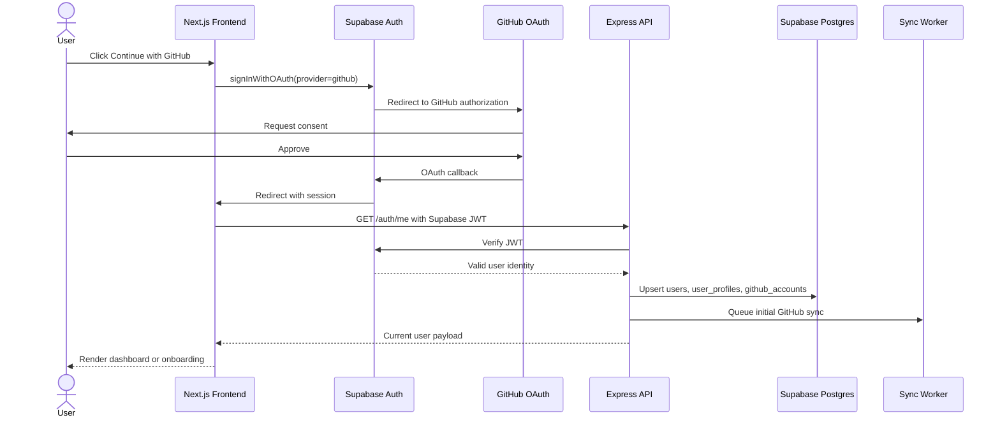

# OpenSource Compass - Auth Flow

## Overview

Authentication uses Supabase Auth with GitHub OAuth. The frontend initiates OAuth, Supabase handles the provider callback, and the backend validates Supabase access tokens for protected REST endpoints.

## GitHub OAuth With Supabase Auth

1. User clicks "Continue with GitHub" on the frontend.
2. Frontend calls Supabase `signInWithOAuth` using the GitHub provider.
3. Supabase redirects the user to GitHub with configured scopes.
4. GitHub redirects back to Supabase.
5. Supabase redirects back to the app callback route with a session.
6. Frontend stores the Supabase session using Supabase client defaults.
7. Frontend calls `GET /api/v1/auth/me`.
8. Backend validates the Supabase JWT and creates or updates application user records.

Recommended GitHub scopes for v1:

- `read:user`
- `user:email`
- `repo` only if private repository support is intentionally enabled
- `read:org` only if organization context is needed

For v1, prefer public repository analysis unless private repo support is a confirmed requirement.

## Session Handling

- Supabase manages access and refresh tokens on the frontend.
- Frontend API requests include `Authorization: Bearer <supabase_access_token>`.
- Backend validates the JWT through Supabase JWKS or Supabase server SDK.
- Backend maps JWT `sub` to `users.id`.
- Expired sessions should return `401` and allow the frontend to refresh through Supabase.

## Token Storage

Supabase stores OAuth provider tokens internally. If the backend needs a GitHub access token for server-side API calls, store it as either:

- An encrypted value in `github_accounts.access_token_encrypted`, using application-level encryption.
- A reference to a managed secret store.

Rules:

- Never return GitHub tokens to the frontend.
- Never log tokens.
- Rotate encryption keys through environment-managed secrets.
- Store token scopes and last verification time.

## User Profile Creation

On first authenticated request after OAuth:

1. Upsert `users` with Supabase user ID, email, display name, avatar.
2. Upsert `user_profiles` with defaults:
   - `experience_level`: `beginner`
   - `preferred_languages`: empty array
   - `preferred_topics`: empty array
   - `settings`: notification defaults
3. Upsert `github_accounts` with GitHub username, GitHub user ID, scopes, and sync metadata.
4. Queue initial GitHub profile and repository sync.
5. Mark onboarding as incomplete until the user confirms goals and preferences.

## Protected Routes

Frontend protected routes should include:

- `/app`
- `/app/repositories`
- `/app/repositories/[owner]/[repo]`
- `/app/issues`
- `/app/roadmap`
- `/app/contributions`
- `/app/notifications`
- `/app/profile`
- `/app/settings`

Route guard behavior:

- If no Supabase session exists, redirect to `/login`.
- If session exists but onboarding is incomplete, redirect to `/onboarding`.
- If onboarding is complete, render the route.

## Backend Authorization Middleware

Recommended middleware stack:

1. `requestIdMiddleware`
2. `corsMiddleware`
3. `jsonBodyParser`
4. `authMiddleware`
5. `rateLimitMiddleware`
6. route handler
7. `errorHandler`

`authMiddleware` should:

- Parse bearer token.
- Verify token with Supabase.
- Attach `req.auth.userId`, `req.auth.email`, and `req.auth.role`.
- Reject missing or invalid tokens with `401`.

Ownership checks should happen in services or route-specific guards before returning user-owned rows.

## Logout Behavior

Logout is initiated from the frontend:

1. Frontend calls Supabase `signOut`.
2. Frontend calls `POST /api/v1/auth/logout` if server-side cleanup is needed.
3. Local client caches are cleared.
4. User is redirected to `/login`.

Do not delete GitHub account records on logout. Account unlinking should be a separate settings action.

## Sequence Diagram

